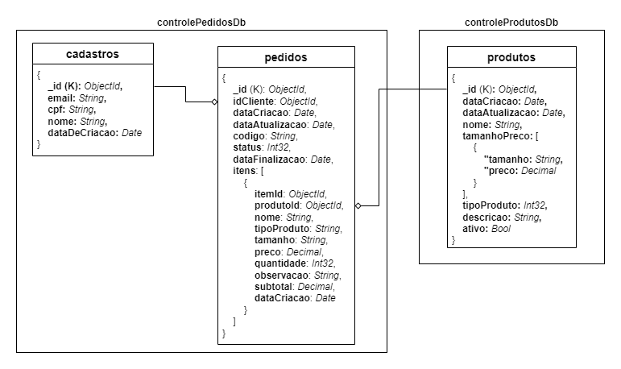

# ATENÇÃO

Este repositório contém apenas a infraestutura referente ao banco de dados. Para acessar o projeto completo clique [aqui](https://github.com/GRUPO28/TechChalange_ControleDePedidos):

# 1 Banco de Dados

Para este projeto utilizamos o MongoDB como banco de dados principal, sendo este um DB NoSQL que trabalha com documentos no formato JSON.

Como provedor, estamos utilizando o [Amazon DocumentDB](https://aws.amazon.com/pt/documentdb/). Um serviço de banco de dados de documentos rápido, escalável, altamente disponível e totalmente gerenciado que oferece suporte a cargas de trabalho do MongoDB.

## 1.1 Modelagem

A seguir temos uma visão do modelo desenvolvido, que está dividido em dois bancos de dados:

- **controlePedidosDb**
    - <u>collections</u>: cadastros e pedidos
- **controleProdutosDb**
    -  <u>collections</u>: produtos

## 1.2 Justificativa

A escolha do MongoDB se deu devido ao seguintes fatores:

1. **Estrutura de Dados Flexível**:
Com o MongoDB, a lanchonete pode armazenar pedidos complexos, sem se preocupar com um esquema rígido de tabelas, como em bancos de dados SQL. A personalização de pedidos (ingredientes específicos, variações de acompanhamentos) pode ser registrada de forma flexível em documentos JSON, permitindo que cada pedido tenha sua própria estrutura única.

2. **Escalabilidade**:
A lanchonete está em expansão, o que significa que a demanda por pedidos pode aumentar rapidamente. O MongoDB é ideal para escalar horizontalmente, permitindo adicionar novos servidores conforme o volume de dados cresce. Isso garante que, mesmo em momentos de alta demanda, o sistema de autoatendimento possa continuar funcionando de forma eficiente, sem comprometer a performance.

3. **Alta Disponibilidade**:
O MongoDB suporta replicação de dados, o que significa que ele pode replicar os dados em vários servidores. Caso um servidor falhe, os dados ainda estarão disponíveis em outro, garantindo que o sistema de autoatendimento continue funcionando sem interrupções.

4. **Conhecimento da Equipe**:
MongoDB é extremamente popular e é utilizado em uma grande variedade de sistemas (principalmente e-commerces), possuindo uma boa documentação e suporte. Além disso, a curva de aprendizado é menos íngreme comparada a bancos de dados SQL tradicionais, especialmente para desenvolvedores que já trabalham com formatos como JSON, como no caso da nossa equipe.

5. **Modelo de Dados Simples**:
O sistema de pedidos de uma lanchonete pode ser relativamente simples em termos de requisitos de transação e relacionamento de dados. Os pedidos, por exemplo, podem ser armazenados como documentos com informações sobre os itens, o cliente, a forma de pagamento e o status do pedido. MongoDB é perfeito para armazenar esses dados de forma direta, sem a necessidade de joins complexos ou de transações envolvendo múltiplas tabelas.